# 🚀 AdventureWorks 2016 Extended ReSeller Sales Analysis

Welcome to the **AdventureWorks 2016 Extended ReSeller Sales Analysis** repository — a comprehensive showcase of enterprise data integration, historical trend analysis, and boardroom-ready insights built using **Microsoft Fabric** and **Power BI**.

---

## 📌 Overview

This project demonstrates:

- How to **ingest enterprise data** from SQL Server (on-prem) into **MS Fabric Lakehouse**.  
- Performing **historical analysis** spanning 10 years (2005–2014) on ReSeller transactions.  
- Deriving actionable **business insights** from measures like **Avg Sales, Discounts, Gross Margins, Units Sold**, and more.  
- Crafting **Power BI dashboards** suitable for **investors, executives, and recruiters**, highlighting both **technical and commercial skills**.

---

## 🛠️ Tech Stack & Tools

| Tool | Purpose |
|------|---------|
| **Microsoft Fabric** | Enterprise data lakehouse, pipelines, and data transformation |
| **SQL Server + SSMS** | On-prem source database hosting AdventureWorks `.bak` file |
| **Power BI Gateway** | Secure connectivity from on-prem SQL Server to Fabric Lakehouse |
| **Power BI** | Interactive dashboards and visualizations |
| **Python / Pandas / Matplotlib** | Exploratory data analysis (optional) |

---

## ☁️ Why Microsoft Fabric?

**Microsoft Fabric** was chosen as the platform for this analysis because it provides:

- **Enterprise-scale data management**: Lakehouse architecture supports large transactional datasets like AdventureWorks.  
- **Seamless integration**: Connects easily with on-prem SQL Server via **Power BI Gateway**.  
- **Advanced analytics pipelines**: Enables historical and scenario-based analysis with minimal infrastructure setup.  
- **Centralized governance & security**: Ideal for enterprise reporting and sharing insights with stakeholders.  
- **Power BI synergy**: Dashboards, visualizations, and storytelling are fully integrated with Fabric datasets.  

**Get started with a Fabric trial:**  
[Microsoft Fabric Trial Capacity](https://learn.microsoft.com/en-us/fabric/get-started)

---

## 📈 Motivation

**Why this analysis matters:**

- **Enterprise Data Integration**: Harness 10 years of transactional data in a **single, accessible lakehouse**.  
- **Historical Analysis**: Track trends in sales, discounts, margins, and units sold.  
- **Insights & Strategy**: Understand the impact of discounts on revenue, identify growth opportunities, and spot profitability trends.  
- **Stakeholder Communication**: Present actionable insights in a **boardroom-ready, investor-focused format**.

---

## 🏗️ Architecture & Data Flow

```mermaid
flowchart TD
    A[📦 Source: AdventureWorks 2016 .bak file] --> B[🖥️ SQL Server + SSMS Docker Image Recommended]
    B --> C[➕ Restore .bak file → On-Prem Database Ready]
    C --> D[🔌 Power BI Gateway Installed]
    D --> E[☁️ MS Fabric Trial Capacity]
    E --> F[🆕 Create Data Pipeline]
    F --> G[🔗 Gateway Connects to SQL Server On-Pmre]
    G --> H[🏞️ Destination: AdventureWorks Fabric Lakehouse]
    H --> I[▶️ Run Pipeline to Import Selected Tables into Fabric Lakehouse]
    I --> J[📊 Power BI Reports Connected to Lakehouse]
    classDef stage fill:#dbeafe,stroke:#3b82f6,stroke-width:2px,white-space:normal;
    class A,B,C,D,E,F,G,H,I,J stage;
```

- Source: AdventureWorks .bak file
- Pipeline: Fabric connects securely to SQL Server via Gateway
- Destination: Lakehouse in Fabric
- Visualization: Power BI dashboards built on imported tables

---

## 📊 Key Analyses & Insights

1. Sales Performance
  - Bikes and Components dominate revenue.
  - Discounts in 2010–2012 drove sales but significantly impacted gross margins.

2. Margins & Profitability
  - Margins dipped notably during high-discount years.
  - Accessories maintain stable margins; Bikes and Components show volatility.

3. Units Sold vs. Revenue
  - Units sold remained relatively stable, but revenue fluctuated due to pricing and discount strategies.
  
4. Scenario Analysis
  - Hypothetical no-discount scenario reveals potential revenue optimization opportunities.
  - Enables boardroom discussions on pricing strategy and margin management.

---

## 💻 How It Was Built

1. **Data Preparation**: Restore AdventureWorks `.bak` file into SQL Server (Docker recommended).  
2. **Integration**: Use Power BI Gateway to connect on-prem SQL Server to Fabric Lakehouse.  
3. **Data Pipeline**: Import selected tables (Reseller Sales, Product, Date, Customer).  
4. **Analysis & Visualization**: Build **Power BI dashboards** covering sales, units, margins, and discounts.  
5. **Scenario & Trend Analysis**: Compare **actual vs. no-discount scenarios** to derive strategic insights.

---

## 🎨 Dashboards & Visuals

- **Sales vs. Margins**: Trend over 10 years by product category.  
- **Discount Impact Analysis**: Show how discounts affected revenue and gross margins.  
- **Units Sold Trends**: Correlation with pricing and promotions.  
- **Executive Summary Dashboard**: Ready for boardroom presentations with clear KPIs.

---

## 🏆 Value Proposition

This project demonstrates:

- ✅ **Technical prowess** in MS Fabric, SQL Server, and Power BI.  
- ✅ **Business acumen** through data-driven insights.  
- ✅ **Strategic storytelling** suitable for **executives, investors, and hiring managers**.  
- ✅ **Enterprise-ready approach** for historical and scenario analysis.

---

## 🧾 Licenses & Credits

- **AdventureWorks 2016 Extended**: Microsoft Sample Database.  
- **Power BI Desktop**: Free/Pro version for dashboard creation.  
- **Microsoft Fabric Trial**: Used for lakehouse and pipeline creation.  
- **Icons & Emojis**: Public domain / Unicode.

---

## 📌 Next Steps

1. Expand analysis to **Internet Sales** tables.  
2. Integrate **Python predictive modeling** for forecasting.  
3. Build **interactive dashboards** with slicers for scenario simulation.  
4. Showcase **storytelling-ready slides** for boardroom presentations.
