# 🚀 AdventureWorks Commercial Analytics

*A governance-driven deep dive into Reseller & Internet Sales performance using Microsoft Fabric.*

---

## 📌 Overview

This project demonstrates:

This project reimagines the **Microsoft AdventureWorks** dataset as a modern analytics case study on **commercial performance, governance, and ethical decision-making**.  
Built end-to-end on **Microsoft Fabric**, it exposes how pricing strategy, reseller participation, and customer growth dynamics influence long-term business sustainability — and what stronger governance could have prevented.

---

## ⚙️ Architecture Snapshot  
A fully integrated Microsoft data stack powers the workflow.

| Layer | Platform | Description |
|--------|-----------|-------------|
| **Data Source** | SQL Server | Restored from AdventureWorks.bak (extended version) |
| **Ingestion** | Power BI Gateway + Fabric Data Pipelines | Secure import and refresh automation |
| **Storage** | Fabric Lakehouse (OneLake + Delta) | ACID-compliant, versioned storage |
| **Modeling** | Power BI Semantic Model | Measures, DAX logic, and relationship design |
| **Visualization** | Power BI Reports | Internet + Reseller perspectives |

---

## ☁️ Why Microsoft Fabric?

**Microsoft Fabric** was chosen as the platform for this analysis because it provides:

- **Enterprise-scale data management**: Lakehouse architecture supports large transactional datasets like AdventureWorks.  
- **Seamless integration**: Connects easily with on-prem SQL Server via **Power BI Gateway**.  
- **Advanced analytics pipelines**: Enables historical and scenario-based analysis with minimal infrastructure setup.  
- **Centralized governance & security**: Ideal for enterprise reporting and sharing insights with stakeholders.  
- **Power BI synergy**: Dashboards, visualizations, and storytelling are fully integrated with Fabric datasets.  

**Get started with a Fabric trial:**  
[Microsoft Fabric Trial Capacity](https://learn.microsoft.com/en-us/fabric/get-started)

---

## 📈 Motivation

**Why this analysis matters:**

- **Enterprise Data Integration**: Harness 10 years of transactional data in a **single, accessible lakehouse**.  
- **Historical Analysis**: Track trends in sales, discounts, margins, and units sold.  
- **Insights & Strategy**: Understand the impact of discounts on revenue, identify growth opportunities, and spot profitability trends.  
- **Stakeholder Communication**: Present actionable insights in a **boardroom-ready, investor-focused format**.

---

## 🏗️ Workflow

```mermaid
flowchart TD
    %% Left: SQL Setup
    subgraph SQL["💾 SQL Setup"]
        A[💾 Download AdventureWorks206.bak<br>from Microsoft Learn] --> B[💾 Restore backup<br>to local SQL Server]
    end

    %% Right: Fabric Setup
    subgraph Fabric["🏗️ MS Fabric Setup"]
        C[🏗️ Setup MS Fabric<br>trial capacity] --> D[🏗️ Create new Fabric workspace<br>for AdventureWorks]
        D --> E[🏗️ Create new Lakehouse<br>in Fabric workspace]
        E --> F[🏗️ Create new pipeline<br>to connect to local SQL<br>via Power BI Gateway]
    end

    %% Power BI Gateway (common step)
    B -->|Data access| G[⚙️ Download, install & configure<br>Power BI Gateway] -->|Connects SQL → Fabric| F

    %% Data Import & Reporting (converging)
    F -->|Validated tables| H[📥 Import tables into Lakehouse<br>& validate]
    H -->|Processed data| I[📥 Download Power BI Desktop<br>& import tables from OneLake]
    I -->|Build semantic model| J[📊 Build semantic model,<br>measures,<br>tables,<br>and reports]
    J -->|Publish reports| K[🚀 Publish reports to<br>AdventureWorks Fabric workspace]

    %% Styling
    classDef sqlBox fill:#cce5ff,stroke:#333,stroke-width:2px;
    classDef gatewayBox fill:#d9ccff,stroke:#333,stroke-width:2px;
    classDef fabricBox fill:#ffd9b3,stroke:#333,stroke-width:2px;
    classDef importBox fill:#ccf2f2,stroke:#333,stroke-width:2px;
    classDef reportBox fill:#d6f5d6,stroke:#333,stroke-width:2px;
    classDef publishBox fill:#e6ffcc,stroke:#333,stroke-width:2px;

    class A,B sqlBox;
    class C,D,E,F fabricBox;
    class G gatewayBox;
    class H,I importBox;
    class J reportBox;
    class K publishBox;

```

- Source: AdventureWorks .bak file
- Pipeline: Fabric connects securely to SQL Server via Gateway
- Destination: Lakehouse in Fabric
- Visualization: Power BI dashboards built on imported tables

---

## 📊 Key Insights & Takeaways

**Top-line growth masked critical margin risks** across both **Reseller** and **Internet Sales** channels — driven not by discounting, but by **uncontrolled pricing decisions** lacking elasticity insight and governance discipline.  

<table>
<tr>
<th>📦 Reseller Sales</th>
<th>💻 Internet Sales</th>
</tr>
<tr>
<td>

- **Volume Growth:** through exsiting resellers only - no new onboarding, raising systemic concentration risk.
- **Margin Collapse:** Runaway **unit price reductions** backfired despite higher sales volumes.  
- **Governance Gap:** Lack of structured pricing controls led to volatility and unsustainable profitability.  

</td>
<td>

- **Revenue Stability:** Year-on-year growth fueled by expanding unique customers, indicating healthier diversification.
- **Profit Stagnation:** **Reactive price drops** ignored elasticity, resulting in minimal margin gains.  
- **Analytical Blind Spot:** Absence of demand-sensitivity models weakened pricing precision.  

</td>
</tr>
</table>

---

### 🧭 Governance & Ethics

> **Strong analytics mean little without strong governance.**  
> This project highlights the risks of chasing growth through reactive pricing and unmonitored channel dependencies.

**What should have been done:**
- **Strong Oversight:** Embed regulatory and ethical governance to enforce disciplined pricing strategies.  
- **Balanced Growth:** Align commercial ambitions with sustainable profitability and risk control.  
- **Fabric + Power BI Synergy:**  
  Transforms complex sales data into **strategic intelligence** — uncovering margin risks, governance gaps, and price-performance trade-offs.  
- **Ethical, Data-Backed Strategy:**  
  Drives sustainable, compliant, and insight-led decision-making across both sales ecosystems.
- 🧩 Establish **price-change governance** with board-level accountability.
- 🌐 Enforce **reseller diversification thresholds** per region.
- 💹 Use **profitability simulations** to test the real impact before approval.
- 🔍 Maintain **data lineage and ethical oversight** within Fabric workloads.

---

### 📈 Growth vs ⚠️ Margin Pressure vs 🧠 Governance Fix  

| Theme | Observation | Strategic Response |
|:------|:-------------|:-------------------|
| 📈 **Growth Surge** | Top-line increase across channels | Reinforce data-driven pricing models to sustain gains |
| ⚠️ **Margin Pressure** | Erosion from unmanaged price reductions | Introduce elasticity-based decision frameworks |
| 🧠 **Governance Fix** | Lack of pricing accountability and oversight | Deploy Fabric + Power BI governance dashboards |

> 💡 **Outcome:** A data-driven, ethically grounded growth strategy — balancing commercial ambition with sustainable profitability and strong accountability.
.

---

## 💻 How It Was Built

This project was designed as an **end-to-end commercial intelligence framework** showcasing how **Microsoft Fabric** and **Power BI** can transform raw AdventureWorks sales data into governance-ready business insights.

### 🔧 Data Foundation  
- **Data Sources:** AdventureWorks fact and dimension tables representing Reseller and Internet Sales channels.  
- **Data Ingestion & Transformation:** Leveraged **Microsoft Fabric Dataflows** and **Lakehouse** integration for structured ingestion, cleansing, and harmonization.  
- **Semantic Modeling:** Built unified **Data Model** with relationships, hierarchies, and calculated measures (e.g., Margin %, Unit Price Variance, Elasticity Index).  

### 📈 Analytics & Insights Layer  
- Developed **Power BI semantic model** exposing dual perspectives — *Reseller* and *Internet* — for comparative analytics.  
- Implemented **dynamic DAX measures** to uncover pricing elasticity, margin volatility, and revenue–cost interactions.  
- Created **cross-channel governance views** aligning profitability insights with business accountability.  

### 🧠 Intelligence & Governance Integration  
- Embedded **governance metrics** to track compliance with pricing thresholds and ethical standards.  
- Unified insights under **Power BI dashboards**, delivering executive-level visibility across growth, margin, and governance metrics.  

### 🌐 Design Philosophy  
- **Clarity over complexity:** Every visual and metric connects directly to a strategic decision driver.  
- **Governance-first mindset:** Designed to highlight not just “what happened,” but “how responsibly it happened.” 
- **Ethical AI & Data Integrity:** Built on transparency, interpretability, and traceable pricing vs. sales intelligence.  

> 💡 **Result:** A modern analytics ecosystem — powered by Fabric and Power BI — where **data, governance, and strategy converge** to deliver sustained, ethical profitability.

---

## 🎨 Dashboards & Visuals

- **Sales vs. Margins**: Trend over 10 years by product category.  
- **Discount Impact Analysis**: Show how discounts affected revenue and gross margins.  
- **Units Sold Trends**: Correlation with pricing and promotions.  
- **Executive Summary Dashboard**: Ready for boardroom presentations with clear KPIs.

---

## 📘 Supporting Documentation

| Document | Description |
|----------|-------------|
| 📊 Full Analysis Flow | End-to-end data prep, modeling & regression workflow |
| 🎯 Executive 1-Pager | High-impact overview for senior stakeholders |
| 🧩 Presentation Deck | Visual storytelling & business interpretation |

---

## 🧠 Tech Stack  

| Tool | Purpose |
|------|----------|
| **Microsoft Fabric** | Unified lakehouse, pipelines & semantic modeling |
| **Power BI** | Data storytelling & commercial dashboards |
| **SQL Server** | Source system for AdventureWorks data |
| **Delta Lake / OneLake** | Reliable, versioned data storage |
| **GitHub** | Documentation, transparency & version control |

---

## 🧱 Run Locally  

1. Clone this repository.  
2. Download & Restore `AdventureWorks2016_EXT.bak` to local SQL Server.  
3. Configure **Power BI Gateway** to connect to your local SQL Server instance.  
4. In **Microsoft Fabric**, create a new workspace and Lakehouse.  
5. Run the data pipeline → validate tables in Lakehouse.  
6. Open **Power BI Desktop**, connect via OneLake → publish reports to Fabric.  

---

## 🧾 Licenses & Credits

- **AdventureWorks 2016 Extended**: Microsoft Sample Database.  
- **Power BI Desktop**: Free/Pro version for dashboard creation.  
- **Microsoft Fabric Trial**: Used for lakehouse and pipeline creation.  
- **Icons & Emojis**: Public domain / Unicode.

---

## 📌 Next Steps

1. **Implement Advanced Pricing Analytics**
Develop models to study price elasticity and demand sensitivity, ensuring pricing strategies optimize both volume and margin sustainably.
2. **Integrate Predictive and Prescriptive Analytics**
Use Python or Azure ML integration to build forecasting and scenario simulation models that guide future pricing and sales strategies.
3. **Enhance Governance Monitoring Dashboards**
Build Power BI dashboards that track compliance to pricing policies and margin thresholds, flagging risks in real time.
4. **Develop Interactive Scenario Simulations*
Enable stakeholders to simulate various pricing, discount, and volume scenarios to visualize business impact through what-if analysis.
5. **Extend Storytelling for Different Audiences**
Tailor storytelling dashboards and slides for executives, sales teams, and governance committees to support data-driven decision making.
6. **Document Governance Framework and Ethical Guidelines**
Explicitly outline governance principles and ethical sales standards informed by data insights, to embed accountability in commercial operations.
