# 🚀 AdventureWorks 2016 Extended ReSeller Sales Analysis

Welcome to the **AdventureWorks 2016 Extended ReSeller Sales Analysis** repository — a comprehensive showcase of enterprise data integration, historical trend analysis, and boardroom-ready insights built using **Microsoft Fabric** and **Power BI**.

---

## 📌 Overview

This project demonstrates:

- How to **ingest enterprise data** from SQL Server (on-prem) into **MS Fabric Lakehouse**.  
- Performing **historical analysis** spanning 10 years (2005–2014) on ReSeller transactions.  
- Deriving actionable **business insights** from measures like **Avg Sales, Discounts, Gross Margins, Units Sold**, and more.  
- Crafting **Power BI dashboards** suitable for **investors, executives, and recruiters**, highlighting both **technical and commercial skills**.

---

## 🛠️ Tech Stack & Tools

| Tool | Purpose |
|------|---------|
| **Microsoft Fabric** | Enterprise data lakehouse, pipelines, and data transformation |
| **SQL Server + SSMS** | On-prem source database hosting AdventureWorks `.bak` file |
| **Power BI Gateway** | Secure connectivity from on-prem SQL Server to Fabric Lakehouse |
| **Power BI** | Interactive dashboards and visualizations |
| **Python / Pandas / Matplotlib** | Exploratory data analysis (optional) |

---

## ☁️ Why Microsoft Fabric?

**Microsoft Fabric** was chosen as the platform for this analysis because it provides:

- **Enterprise-scale data management**: Lakehouse architecture supports large transactional datasets like AdventureWorks.  
- **Seamless integration**: Connects easily with on-prem SQL Server via **Power BI Gateway**.  
- **Advanced analytics pipelines**: Enables historical and scenario-based analysis with minimal infrastructure setup.  
- **Centralized governance & security**: Ideal for enterprise reporting and sharing insights with stakeholders.  
- **Power BI synergy**: Dashboards, visualizations, and storytelling are fully integrated with Fabric datasets.  

**Get started with a Fabric trial:**  
[Microsoft Fabric Trial Capacity](https://learn.microsoft.com/en-us/fabric/get-started)

---

## 📈 Motivation

**Why this analysis matters:**

- **Enterprise Data Integration**: Harness 10 years of transactional data in a **single, accessible lakehouse**.  
- **Historical Analysis**: Track trends in sales, discounts, margins, and units sold.  
- **Insights & Strategy**: Understand the impact of discounts on revenue, identify growth opportunities, and spot profitability trends.  
- **Stakeholder Communication**: Present actionable insights in a **boardroom-ready, investor-focused format**.

---

## 🏗️ Architecture & Data Flow

```mermaid
flowchart TD
    %% Left: SQL Setup
    subgraph SQL["💾 SQL Setup"]
        A[💾 Download AdventureWorks206.bak<br>from Microsoft Learn] --> B[💾 Restore backup<br>to local SQL Server]
    end

    %% Right: Fabric Setup
    subgraph Fabric["🏗️ MS Fabric Setup"]
        C[🏗️ Setup MS Fabric<br>trial capacity] --> D[🏗️ Create new Fabric workspace<br>for AdventureWorks]
        D --> E[🏗️ Create new Lakehouse<br>in Fabric workspace]
        E --> F[🏗️ Create new pipeline<br>to connect to local SQL<br>via Power BI Gateway]
    end

    %% Power BI Gateway (common step)
    B -->|Data access| G[⚙️ Download, install & configure<br>Power BI Gateway] -->|Connects SQL → Fabric| F

    %% Data Import & Reporting (converging)
    F -->|Validated tables| H[📥 Import tables into Lakehouse<br>& validate]
    H -->|Processed data| I[📥 Download Power BI Desktop<br>& import tables from OneLake]
    I -->|Build semantic model| J[📊 Build semantic model,<br>measures,<br>tables,<br>and reports]
    J -->|Publish reports| K[🚀 Publish reports to<br>AdventureWorks Fabric workspace]

    %% Styling
    classDef sqlBox fill:#cce5ff,stroke:#333,stroke-width:2px;
    classDef gatewayBox fill:#d9ccff,stroke:#333,stroke-width:2px;
    classDef fabricBox fill:#ffd9b3,stroke:#333,stroke-width:2px;
    classDef importBox fill:#ccf2f2,stroke:#333,stroke-width:2px;
    classDef reportBox fill:#d6f5d6,stroke:#333,stroke-width:2px;
    classDef publishBox fill:#e6ffcc,stroke:#333,stroke-width:2px;

    class A,B sqlBox;
    class C,D,E,F fabricBox;
    class G gatewayBox;
    class H,I importBox;
    class J reportBox;
    class K publishBox;

```

- Source: AdventureWorks .bak file
- Pipeline: Fabric connects securely to SQL Server via Gateway
- Destination: Lakehouse in Fabric
- Visualization: Power BI dashboards built on imported tables

---

## 📊 Key Insights & Takeaways

1. **Revenue Growth Conceals Margin Erosion Risks**
Both channels experienced top-line growth; however, underlying margin deterioration was driven by different pricing failures rather than discounting.
2. **Reseller Sales Margin Erosion Caused by Runaway Average Unit Price Reductions**
In Reseller Sales, aggressive cuts to average unit prices aimed at boosting volume backfired, leading to disastrous margin outcomes despite higher sales volumes.
3. **Internet Sales Margin Stagnation Due to Unchecked Price Drops Without Elasticity Analysis**
Internet Sales decision-makers frequently lowered prices as soon as cost conditions improved, but without considering price elasticity or demand sensitivity, resulting in minimal margin improvement.
4. **Strong Governance and Regulatory Oversight Are Essential**
Embedding disciplined governance frameworks and regulatory checks is critical to enforce pricing strategies that balance growth ambitions with sustainable profitability and ethical standards across both sales channels.
5. **High-level Highlights**
- Reseller Sales: Experienced volume growth driven by product diversification but suffered margin collapse from poorly managed price reductions.
- Internet Sales: Showed stable revenue growth and broader customer reach supported by digital analytics, but margins remained under pressure due to reactive pricing decisions.
6. **Key Lowlights**
- Reseller Sales: Margin volatility and erosion caused by inconsistent pricing governance and unsustainable price drops.
- Internet Sales: Margin compression from rapid price reductions untempered by demand elasticity studies, eroding profitability.
7. **Fabric + Power BI Enable Comprehensive, Actionable Insights**
The integration transforms complex transactional data into strategic intelligence that highlights not only volume and revenue trends but reveals margin risks and governance gaps, driving balanced commercial decision-making.
8. **Ethical, Data-Backed Strategy Supports Sustainable Growth**
Actionable insights encourage aligning sales growth with strong ethical standards and robust governance, ensuring long-term value creation and risk management across reseller and internet sales ecosystems.

---

## 💻 How It Was Built

1. **Data Preparation**: Restore AdventureWorks `.bak` file into SQL Server (Docker recommended).  
2. **Integration**: Use Power BI Gateway to connect on-prem SQL Server to Fabric Lakehouse.  
3. **Data Pipeline**: Import selected tables (Reseller Sales, Product, Date, Customer).  
4. **Analysis & Visualization**: Build **Power BI dashboards** covering sales, units, margins, and discounts.  
5. **Scenario & Trend Analysis**: Compare **actual vs. no-discount scenarios** to derive strategic insights.

---

## 🎨 Dashboards & Visuals

- **Sales vs. Margins**: Trend over 10 years by product category.  
- **Discount Impact Analysis**: Show how discounts affected revenue and gross margins.  
- **Units Sold Trends**: Correlation with pricing and promotions.  
- **Executive Summary Dashboard**: Ready for boardroom presentations with clear KPIs.

---

## 🏆 Value Proposition

This project demonstrates:

- ✅ **Technical prowess** in MS Fabric, SQL Server, and Power BI.  
- ✅ **Business acumen** through data-driven insights.  
- ✅ **Strategic storytelling** suitable for **executives, investors, and hiring managers**.  
- ✅ **Enterprise-ready approach** for historical and scenario analysis.

---

## 🧾 Licenses & Credits

- **AdventureWorks 2016 Extended**: Microsoft Sample Database.  
- **Power BI Desktop**: Free/Pro version for dashboard creation.  
- **Microsoft Fabric Trial**: Used for lakehouse and pipeline creation.  
- **Icons & Emojis**: Public domain / Unicode.

---

## 📌 Next Steps

1. **Implement Advanced Pricing Analytics**
Develop models to study price elasticity and demand sensitivity, ensuring pricing strategies optimize both volume and margin sustainably.
2. **Integrate Predictive and Prescriptive Analytics**
Use Python or Azure ML integration to build forecasting and scenario simulation models that guide future pricing and sales strategies.
3. **Enhance Governance Monitoring Dashboards**
Build Power BI dashboards that track compliance to pricing policies and margin thresholds, flagging risks in real time.
4. **Develop Interactive Scenario Simulations*
Enable stakeholders to simulate various pricing, discount, and volume scenarios to visualize business impact through what-if analysis.
5. **Extend Storytelling for Different Audiences**
Tailor storytelling dashboards and slides for executives, sales teams, and governance committees to support data-driven decision making.
6. **Document Governance Framework and Ethical Guidelines**
Explicitly outline governance principles and ethical sales standards informed by data insights, to embed accountability in commercial operations.
