# 🧭 AdventureWorks Sales — Full Analysis Flow  
*A backward-looking investigation of Reseller and Internet channel performance, governance, and systemic risk.*

---

## 📘 1 · Purpose & Scope
This document details the full analytical workflow used to evaluate:  
- **Reseller Sales (2005–2014)** and **Internet Sales (2010–2014)** performance trends.  
- Concentration risks, channel resilience, and systemic vulnerabilities.  
- Governance, ethics, and pricing considerations in commercial decisions.  

The goal is interpretive — to provide **actionable insights and strategic recommendations**, not predictive modeling.

---

## 🧱 2 · Environment & Platform
Developed on **Microsoft Fabric (trial capacity)** using:

| Component | Purpose |
|------------|----------|
| **SQL Server** | local environment to restore AdventureWorks.bak to SQL Server table |
| **OneLake** | Centralized repository for raw & processed sales data |
| **Delta Lake** | ACID-compliant storage for consistent tables |
| **Fabric Notebooks** | Interactive environment for EDA, analytics, and scenario modeling |
| **Data Pipelines** | Automated ingestion + transformation for reproducibility |
| **Power BI** | for building semantic models and reporting |

Local reproducibility is supported via `sample_data/`.

---

## 2A . Operational Workflow 

```mermaid
flowchart TD
    %% Left: SQL Setup
    subgraph SQL["💾 SQL Setup"]
        A[💾 Download AdventureWorks206.bak<br>from Microsoft Learn] --> B[💾 Restore backup<br>to local SQL Server]
    end

    %% Right: Fabric Setup
    subgraph Fabric["🏗️ MS Fabric Setup"]
        C[🏗️ Setup MS Fabric<br>trial capacity] --> D[🏗️ Create new Fabric workspace<br>for AdventureWorks]
        D --> E[🏗️ Create new Lakehouse<br>in Fabric workspace]
        E --> F[🏗️ Create new pipeline<br>to connect to local SQL<br>via Power BI Gateway]
    end

    %% Power BI Gateway (common step)
    B -->|Data access| G[⚙️ Download, install & <br>configure<br>Power BI Gateway] -->|Connects SQL → Fabric| F

    %% Data Import & Reporting (converging)
    F -->|Validated tables| H[📥 Import tables into <br>Lakehouse & validate]
    H -->|Processed data| I[📥 Download Power BI <br>Desktop & import tables <br>from OneLake]
    I -->|Build semantic model| J[📊 Build semantic model, <br>measures, tables,<br>and reports]
    J -->|Publish reports| K[🚀 Publish reports to<br>AdventureWorks Fabric <br>workspace]

    %% Styling
    classDef sqlBox fill:#cce5ff,stroke:#333,stroke-width:2px;
    classDef gatewayBox fill:#d9ccff,stroke:#333,stroke-width:2px;
    classDef fabricBox fill:#ffd9b3,stroke:#333,stroke-width:2px;
    classDef importBox fill:#ccf2f2,stroke:#333,stroke-width:2px;
    classDef reportBox fill:#d6f5d6,stroke:#333,stroke-width:2px;
    classDef publishBox fill:#e6ffcc,stroke:#333,stroke-width:2px;

    class A,B sqlBox;
    class C,D,E,F fabricBox;
    class G gatewayBox;
    class H,I importBox;
    class J reportBox;
    class K publishBox;
```

---

## 🧹 3 · Data Preparation & Quality Checks
1. **Ingest** dimension and fact tables tables from Fabric OneLake to Power BI Desktop.  
2. **Validate columns:** `ResellerID`, `CustomerID`, `SalesAmount`, `UnitsSold`, `Year` on Power BI Desktop.  
3. **Filter:** remove duplicates, missing IDs, or zero/negative sales.  
4. **Derive metrics:** unique reseller/customer counts, volume growth, average sales per partner/customer.  
5. **Build semantic model:** Build semantic model and reports on Power BI and publish to AdventureWorks Fabric workspace trial capacity .  

**Business rationale:** ensures **clean, auditable inputs** and **reliable concentration and growth metrics**.

---

## 📊 4 · Exploratory Data Analysis (EDA)
**Actions**
- Compute yearly sales trends, average sales per reseller/customer, and total volumes.  
- Visualize unique resellers/customers by year, and sales growth by channel.  

**Visual placeholders**
- 
- 

**Findings**
- Reseller growth is **volume-driven**; total unique resellers flat (2005–2014).  
- Internet channel shows **increasing unique customers** (2010–2014).  
- Reseller concentration poses **systemic risk**; Internet channel provides resilience.

---

## 📈 5 · Advanced Analytics & Insights

**Reseller Channel**
- **Volume Concentration:** Existing resellers account for most growth.  
- **Risk:** Single large reseller failure could disrupt the market.  
- **Recommendation:** Diversify reseller base.

**Internet Channel**
- **Customer Growth:** New unique customers increase year-over-year.  
- **Resilience:** Channel can absorb shocks and scale sustainably.

**Governance & Ethics**
- ⚖️ Structured approvals for discounts & pricing changes.  
- 💡 Incentives aligned with sustainable growth, not just short-term volume.  
- 📊 Transparent reporting and audit trails for pricing & promotions.  

**Visual placeholders**
- 
- 

---

## ⚖️ 6 · Risk Assessment
| Risk Type | Observation | Impact |
|-----------|-------------|--------|
| Reseller Concentration | Flat unique reseller count | High systemic & geographic risk |
| Lack of Diversification | No new resellers onboarded | Vulnerability to partner collapse |
| Internet Resilience | Growing unique customers | Lower risk, scalable growth |
| Pricing & Discount Risk | Blanket discounts without review | Margin erosion, partner conflict |

**Scenario Analysis**
- Model revenue shocks from a top reseller failure.  
- Compare Reseller vs Internet channel absorption capacity.

---

## 🧩 7 · Strategic Recommendations
- **Diversify Reseller Base:** Reduce dependency on a few partners.  
- **Leverage Internet Growth:** Scale revenue with resilient customer base.  
- **Embed Governance:** Structured approvals, audit trails, incentive alignment.  
- **Monitor Risk:** Regular concentration checks and board reporting.

---

## 🧾 8 · Communication Artifacts
**Deliverables**
- Executive summary → `docs/presentation.md`  
- Visuals → `images/` (sales trends, unique counts, governance dashboards)  
- Tables → `reports/` (metrics, risk tables)  
- README overview + this analysis flow → ensures reproducibility

---

## 🧩 9 · Optional Extensions
- Segment reseller and customer growth by **geography or product category**.  
- Incorporate **profitability & margin analysis** at partner or product level.  
- Automate **Fabric pipeline refreshes** for future updates.

---

## 🏁 10 · Conclusion (Summary Narrative)
> **Reseller growth is concentrated and volume-driven, posing systemic risk.**  
> **Internet channel shows expanding, resilient customer base.**  
> Strong governance, aligned incentives, and structured approvals are critical to sustainable growth.  
> These insights provide a **framework for strategic decision-making and risk mitigation**.

---

### 🧠 Next Steps

---

**License:** MIT | **Maintainer:** Anil · [`github.com/AwesomeAnil`](https://github.com/AwesomeAnil)
