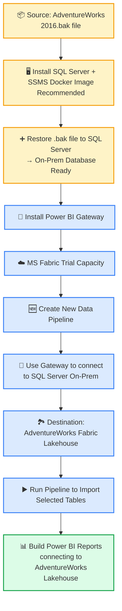

# 🌎 AdventureWorks 2016 Extended — ReSeller Sales Performance Analysis (2005–2014)

---

## 🎯 Slide 1: Title & Context
**AdventureWorks 2016 Extended — ReSeller Sales Analysis**  
**Author:** Anilwhatsapp Mon  
**Purpose:** Showcase **technical mastery on MS Fabric** and **commercial insight** via multi-year reseller performance trends.  

> Leverages Fabric for enterprise data integration, historical analytics, and visual storytelling in Power BI.

---

## 💡 Slide 2: Motivation
**Why this analysis matters:**
- Demonstrates how **MS Fabric empowers analysts** to combine enterprise-scale datasets.  
- Historical data analysis reveals **trends, anomalies, and strategic insights**.  
- Visualized through **Power BI dashboards**, enabling **clear executive decision-making**.  
- Highlights skills that stakeholders & decision makers  **value for business intelligence, analytics, and commercial strategy roles**.  

### 📊 **AdventureWorks ReSeller Sales Analysis (2005–2014) Extended Version**

#### 🔹 1️⃣ Enterprise Data Access & Integration
- 🏞️ MS Fabric Lakehouse  
- 🖥️ On-prem SQL Server + Power BI Gateway  
- 🔗 Seamless integration of historical transactional data  

#### 🔹 2️⃣ Historical Analysis
- 📅 10 years of reseller data  
- 📈 Key measures: Avg Sales, Units Sold, Discounts appled, Unit Costs, Unit Prices  & Product Margins
- 🕵️‍♂️ Trend detection, anomaly spotting, scenario comparison  

#### 🔹 3️⃣ Insights & Inferences
- 💵 Revenue spikes vs. margin erosion  
- 🎯 Impact of discount campaigns on profitability  
- 📉 Identify sustainable vs. short-term strategies  

#### 🔹 4️⃣ Showcase Skills
- 📊 Power BI visualizations and dashboards  
- 🏛️ Boardroom-ready insights for executives  
- 💡 Demonstrates technical + business acumen  

---

### 🔹 🎯 Result
- ✅ Convincing storytelling for investors & recruiters  
- ✅ Highlights ability to translate enterprise data into strategic decisions  

---

## 🛠 Slide 3: Technical Architecture (MS Fabric + Power BI)
**Built Using:**
- **MS Fabric Data Lake:** Centralized, scalable repository for historical and transactional data.  
- **Power BI:** Multi-layer analytics and visualization, including:
  - Trend analysis (sales, units, discounts)  
  - Profitability modeling (gross margins, cost analysis)  
  - Scenario comparison (with/without discounts)  
- **Key Benefits of Fabric:**
  - Handles **large-scale datasets** efficiently  
  - Integrates with **Power BI** for instant visualization  
  - Enables **data-driven storytelling for executives and investors**

**[Insert architecture diagram icon + arrows for data flow]**

---

## 📊 Slide 4: Key Measures & Methodology
**Measures Analyzed (FY 2005–2014):**
1. Avg Sales (w/ & w/o Discounts)  
2. Avg Discounts (%)  
3. Avg Product Costs  
4. Avg Unit Prices  
5. Avg Units per Transaction  
6. Gross Margins  
7. Total Sales  
8. Total Units Sold  

**Methodology:**
- Multi-table temporal analysis  
- Scenario comparison (actual vs. hypothetical)  
- Integrated insights on revenue, margin, pricing, and volume  

---

## 🚀 Slide 5: Revenue & Sales Trends
**Observation:**
- Peak **Total Sales in 2010 (\$2.597B)** driven by **transaction/volume surge**, not per-unit increases.  
- Units per transaction remained flat (~3.5 units).  
- Post-2012: sales returned to baseline (~\$948M) as promotional campaigns ended.  

**Total Sales by Fiscal Year & Category]**

---

## 💵 Slide 6: Pricing & Discounts Impact
- Discounts introduced 2010–2012 (3 → 13 %)  
- Avg Unit Prices dipped slightly during discount period  
- Gross Margins collapsed (negative for high-cost categories)  
- Revenue spike achieved **at the expense of profitability**  

**Avg Discounts**

**Unit Prices**

---

## 📈 Slide 7: Units & Volume Analysis
- **Avg Units per Transaction:** Stable (~3.5 units)  
- **Total Units Sold:** 2010 spike driven by expanded reseller activity  
- Revenue peak is **transaction-driven, not per-unit**  
- Post-promotion normalization by 2014  

**Total Units Sold by Fiscal Year & Category]**

---

## 🏆 Slide 8: Profitability Insights
- **Category Profitability Hierarchy:** Accessories > Clothing > Components > Bikes  
- Temporary margin collapse 2010–2012 due to discounting strategy  
- Recovery by 2014 aligns with **sustainable pricing and discount strategy**  

**Gross Margins by Category & Year**

---

## 🔍 Slide 9: Strategic Inferences
- Promotions boost revenue but reduce margins; careful calibration needed  
- Units per transaction show **resilience of reseller behavior**  
- Enterprise-level tools (Fabric + Power BI) enable **data-driven, boardroom-ready insights**  
- Demonstrates technical + business intelligence skills critical for recruiters  

---

## 📌 Slide 10: Executive Takeaways
1. Short-term revenue spikes can mask margin erosion.  
2. Fabric + Power BI combination enables **high-impact storytelling** from transactional data.  
3. Analysis confirms **pricing, discount, and volume strategies are tightly correlated** with profitability outcomes.  
4. Shows ability to derive **actionable insights** from complex enterprise datasets.  

---

## 📂 Slide 11: Appendix / Charts
- **Avg Sales w/ Discounts**

 

- **Avg Sales w/ Discounts (hypothetical)**

- **Product Cost trends**

---

## 📝 Slide 12: Licenses & Credits
- **AdventureWorks 2016 Extended Dataset:** Provided by Microsoft for learning and analysis purposes  
  - [Microsoft AdventureWorks Sample Databases](https://github.com/microsoft/sql-server-samples)  
- **Power BI:** Microsoft Power BI Desktop for visualization  
- **MS Fabric:** Microsoft Fabric for enterprise-scale data integration  
- Analysis, markdown preparation, and insights: **Anilwhatsapp Mon**  

---

## ✅ Slide 13: Closing / Call-to-Action
- AdventureWorks analysis demonstrates **technical, analytical, and commercial acumen**.  
- Ready for **investor, boardroom, or consultant presentation**.  
- Full Power BI dashboards and Fabric integration are **available for review**.  
- Highlights ability to **translate enterprise data into strategic, actionable insights**.  

