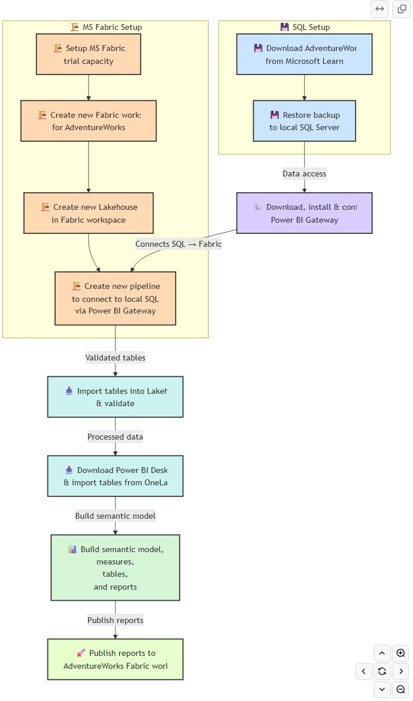

# AdventureWorks 2016 — Extended  
**Transforming operational history into insight-driven business recovery**

> *An end-to-end, reproducible analytics experience built on Microsoft Fabric & Power BI.*

---

## 🚀 Executive Summary

This project reimagines the legendary **AdventureWorks 2016** dataset as a modern, enterprise-grade analytics showcase.  
It demonstrates how raw historical data can be converted into **executive-ready dashboards**, **root cause analysis**, and **actionable recovery playbooks** — bridging business goals with technical excellence.

**Key Value:**
- Enterprise-scale reproducibility using Fabric & Power BI
- Storytelling dashboards designed for decision-makers
- Governed, documented, and performance-tuned semantic models
- Real-world business scenarios for sales, product, and customer analytics

---

## 🏢 What is AdventureWorks?

**AdventureWorks** is Microsoft’s flagship sample database — a fictional manufacturing and retail company that produces and sells bicycles and related accessories.  
Originally designed to demonstrate SQL Server features, it has become a global benchmark dataset for showcasing modern data engineering, analytics, and visualization techniques.

This **Extended Edition** has 10 years Reseller data from 2005 - 2014, transforming it from a static demo into a **real-world enterprisse analytics case study** that mirrors how organizations evolve from historical data to actionable business intelligence. 


## 🧭 System Architecture

<p align="center">
  
  <br><sub>Figure: End-to-end AdventureWorks Extended architecture.</sub>
</p>


---

## 📊 Live Report Gallery

Below are embedded, fully interactive Power BI reports hosted as `.html` files on GitHub Pages.  
> 💡 *Best viewed in full-screen mode for high-resolution visuals.*

### 1️⃣ Executive Overview Dashboard
<iframe 
  src="https://awesomeanil.github.io/adventureworks-2016-extended/reports/Performance.html" 
  width="100%" 
  height="750px" 
  frameborder="0" 
  allowfullscreen>
</iframe>

<sub>[🔗 Open Full Screen](https://awesomeanil.github.io/adventureworks-2016-extended/reports/Performance.html)</sub>

---

### 2️⃣ Reseller Sales Dashboard
<iframe 
  src="https://awesomeanil.github.io/adventureworks-2016-extended/reports/ResellerSales.html" 
  width="100%" 
  height="750px" 
  frameborder="0" 
  allowfullscreen>
</iframe>

<sub>[🔗 Open Full Screen](https://awesomeanil.github.io/adventureworks-2016-extended/reports/ResellerSales.html)</sub>

---

### 3️⃣ Intenet Customer Sales Dashboard
<iframe 
  src="https://awesomeanil.github.io/adventureworks-2016-extended/reports/InternetSales.html" 
  width="100%" 
  height="750px" 
  frameborder="0" 
  allowfullscreen>
</iframe>

<sub>[🔗 Open Full Screen](https://awesomeanil.github.io/adventureworks-2016-extended/reports/InternetSales.html)</sub>

---

## 🧩 Project Structure

| Path | Purpose |
|------|----------|
| `docs/` | Full documentation: architecture, governance, and playbooks |
| `notebooks/` | Reproducible analytics & transformation notebooks |
| `dashboards/` | Power BI `.pbix` files and report definitions |
| `scripts/` | ETL, bootstrap, and reproducibility utilities |
| `data/` | Sample datasets and dictionaries (synthesized or masked) |

---

## 🧠 Business Scenarios

| Area | Use Case | KPI Focus |
|------|-----------|-----------|
| **Sales Recovery** | Identify top declining product families | Quota Attainment %, YoY Delta |
| **Customer Intelligence** | Segment profitable vs at-risk customers | Retention %, Margin Contribution |
| **Product Performance** | Detect overstock and replenishment risk | Inventory Aging, Fill Rate |
| **Operational Efficiency** | Uncover channel and region variance | Cycle Time, Lead Response |

---

## ⚙️ Technical Highlights

- **Fabric-based Lakehouse** pattern with structured zones  
- **Delta-style parquet tables** for data reproducibility  
- **Semantic model design** using dimensional schemas and DAX measures  
- **Interactive dashboards** tailored for storytelling and decision velocity  
- **Data governance** documented within `/docs/Architecture.md` and `/docs/Runbook.md`

---

## 🧰 How to Run Locally

> Requires Docker, Python 3.10+, and Power BI Desktop.

```bash
# Clone
git clone https://github.com/AwesomeAnil/adventureworks-2016-extended.git
cd adventureworks-2016-extended

# Start reproducible environment
docker-compose up --build -d

# (or) manually run ETL
python scripts/etl/load_stage.py --config configs/local.yml

# Launch Jupyter notebooks
http://localhost:8888
```
---

## 📘 Documentation Index

| Document | Description |
|-----------|--------------|
| [Architecture.md](Architecture.md) | End-to-end system overview |
| [Runbook.md](Runbook.md) | Step-by-step setup and reproducibility guide |
| [Playbooks/](Playbooks/) | Business remediation playbooks |
| [DataDictionary.md](DataDictionary.md) | Schema and field-level metadata |


---

## 🏁 Outcomes & Value

| Stakeholder | Outcome |
|--------------|----------|
| **Executives** | Clear story from KPIs → Root Cause → Recovery Plan |
| **Analysts** | Reusable models and validated data lineage, Governance, controls |
| **Developers** | Modular ETL, semantic model, and Governance, Data Engineerig, Fabric OneLake, Fabric Warehouses |

---

## 📍 Roadmap

- [ ] CI for notebook reproducibility  
- [ ] ML-driven anomaly detection (v2)  
- [ ] Advanced scenario simulation & forecasting module  
- [ ] Multi-tenant deployment template  

---

## 👤 Author

**Anil Jacob**  
*Data Strategy • BI Governance • Analytics Leadership*  
🌐 [GitHub Profile](https://github.com/AwesomeAnil)  
💼 [LinkedIn Profile](https://linkedin.com/in/anil-jacobs)  

---

> “Data only matters when it drives better business outcomes.”  
> — *AdventureWorks Extended, by Anil Jacob*


# Open Power BI report files (.pbix)
dashboards/
